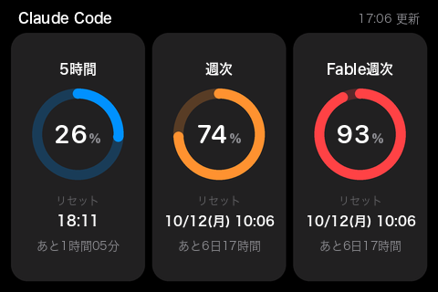
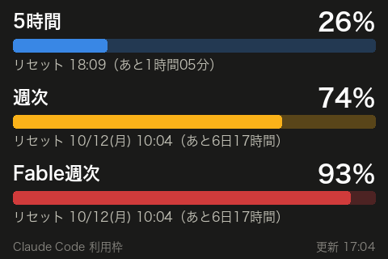

# claude-usage-display

Claude Code の利用枠 3 つ（**5 時間・週次・Fable 週次**）を、Mac に USB でつないだ 3.5 インチのディスプレイにメーターで常時表示します。



- 画面は 480×320 の横向きです。カード 3 枚に、円形のゲージで使用率を、その下にリセット時刻（日本時間）とリセットまでの残り時間を出します
- ゲージの色は使用率で変わります。70% 未満は青、70% 以上はオレンジ、90% 以上は赤です
- 利用枠は 2 分ごとに取得し、画面は 1 分ごとに描き直します（残り時間の表示を進めるため）
- 取得に失敗したときは、前回の値を残したまま、上端の見出しの位置に理由をオレンジで、右にその値を取得した時刻（「16:50 時点」）を出します
- まだ値が無いときは、ゲージを灰色にして「--」を出します

最初に作った横棒の画面も `--theme classic` で使えます。



どちらの画面も `preview --demo` で画像として作れます（「使い方」を参照）。

## 画面のデザイン

ゲージ型は、Apple のウィジェット（バッテリー）とアクティビティのリングを手本にしています。

- 色は Apple の [Human Interface Guidelines の Color](https://developer.apple.com/design/human-interface-guidelines/color) にあるダークモードのシステムカラー（Blue・Orange・Red・Gray）です。カードの面だけは、RGB565 で緑に寄らない無彩色に置き換えています
- 文字の大きさは、[Human Interface Guidelines の Typography](https://developer.apple.com/design/human-interface-guidelines/typography) にある iOS の既定の文字スタイル（Title 1 28・Subhead 15・Footnote 13・Caption 1 12）の pt を、そのままピクセルで使っています。このディスプレイは [iPhone 3GS](https://support.apple.com/kb/SP565) と同じ 3.5 インチ・480×320 なので、iPhone で見る文字とほぼ同じ大きさになります
- 数字は SF Pro Rounded、日本語はヒラギノ角ゴシックです。どちらも macOS に入っているフォントを使います
- 図形は 4 倍の大きさで描いてから縮め、縁を滑らかにしています。文字は縮めるとかすれるため、縮めた後に書いています

## 対応機種

| 項目 | 内容 |
|---|---|
| ディスプレイ | Turing Smart Screen 3.5 インチ（rev A）。USB の ID が `1a86:5722`、シリアル番号が `USB35INCHIPSV2` のもの |
| Mac | macOS。Homebrew が使えること |
| Claude Code | Claude のサブスクリプション（Pro・Max）でログインしていること。動作を確かめたのは Max（5x）です |

同じ 3.5 インチでも、XuanFang の rev B は USB の ID が同じ `1a86:5722` で、シリアル番号（`2017-2-25`）だけが違います。rev B は通信方式が違うため動きません。Turing の 2.1・2.8・5・8 インチ（rev C）や、Kipye の 3.5 インチ（rev D）は USB の ID から違い、これも動きません（機種の区分は turing-smart-screen-python の `library/lcd/lcd_comm_rev_*.py` によります）。

USB の ID とシリアル番号は、つないだ状態で次のコマンドで確かめられます（`USB Vendor ID: 0x1a86`、`USB Product ID: 0x5722`、`Serial Number: USB35INCHIPSV2` が出れば対象です）。

```
system_profiler SPUSBHostDataType | grep -B8 -A2 'USB Product ID: 0x5722'
```

macOS 27 には `SPUSBDataType` がありません。`SPUSBHostDataType` を使います。

## 準備

```
brew install python libusb
cd claude-usage-display
python3 -m venv .venv
.venv/bin/pip install -r requirements.txt
```

確認:

```
.venv/bin/python -m unittest discover -s tests
.venv/bin/python -m claude_usage_display preview -o preview.png
```

`preview.png` に今の利用枠が描かれていれば、Keychain の読み取りと利用枠の取得はできています。

## 使い方

```
.venv/bin/python -m claude_usage_display preview -o preview.png    # 今の値で画像だけ作る（ディスプレイ不要）
.venv/bin/python -m claude_usage_display preview --demo -o demo.png # API を呼ばず見本の値で描く
.venv/bin/python -m claude_usage_display probe                     # ディスプレイの USB 情報と、インターフェースを確保できるか
.venv/bin/python -m claude_usage_display test-pattern              # 向きと色の確認画面（左上が赤で「左上」）
.venv/bin/python -m claude_usage_display run                       # 常駐して表示し続ける（Ctrl+C で終了）
```

オプション:

| オプション | 使えるコマンド | 既定 | 内容 |
|---|---|---|---|
| `--theme gauge\|classic` | `preview`・`run` | `gauge` | 画面のデザイン。`classic` は横棒の画面 |
| `--brightness N` | `test-pattern`・`run` | 30 | 明るさ（0〜100） |
| `--flip` | `test-pattern`・`run` | なし | 上下を反転する。ケーブルの向きに合わせて付ける |
| `--interval 秒` | `run` | 120 | 利用枠を取得する間隔（60 以上） |
| `--save-png パス` | `run` | なし | ディスプレイへ送った画像を、このパスにも保存する（確認用） |

モデル別の週次上限は、既定で Fable のものを出します。別のモデルの上限を出すときは、コマンドの前に `--model` を付けます（例: `.venv/bin/python -m claude_usage_display --model Opus run`）。その上限が無いプランでは、値の代わりに「--」（横棒の画面では「—」）が出ます。

初めてつないだときは、`probe` → `test-pattern` → `run` の順に試してください。自動起動を登録している場合は、先に `scripts/uninstall-launch-agent.sh` で止めます。2 つのプロセスが同じディスプレイへ書くと、パネルが画素を数え違えて画面が崩れるためです。

## 自動起動

ログインしたときに `run` を起動し、止まったら起動し直すように、launchd に登録します。

```
scripts/install-launch-agent.sh            # 登録（既定のオプションで起動）
scripts/install-launch-agent.sh --flip     # run に渡すオプションを付けて登録
scripts/install-launch-agent.sh --theme classic  # 横棒の画面で登録
scripts/uninstall-launch-agent.sh          # 解除
```

- 登録すると `~/Library/LaunchAgents/jp.co.studioc.claude-usage-display.plist` ができます。ひな形は `launchd/jp.co.studioc.claude-usage-display.plist` です
- ログは `~/Library/Logs/claude-usage-display.log` に出ます。接続・切断や取得の失敗など、状態が変わったときだけ書くため、ほとんど増えません
- ディスプレイがつながっていないあいだは、10 秒ごとに接続を確かめるだけで、利用枠の API は呼びません。ディスプレイが届く前に登録しておいても負荷はありません
- オプションを変えるときは、`install-launch-agent.sh` を新しいオプションで実行し直します（登録し直します）
- リポジトリの場所を移したときも、移した先で `install-launch-agent.sh` を実行し直します

状態の確認:

```
launchctl print gui/$(id -u)/jp.co.studioc.claude-usage-display | grep -E "^$(printf '\t')(state|pid|last exit code) ="
tail -f ~/Library/Logs/claude-usage-display.log
```

## 困ったとき

| 症状 | 対処 |
|---|---|
| 画面が崩れる（縞模様・ずれた画像） | ディスプレイの USB-C を抜き差しします。パネルは画素を数えながら受け取るため、一度ずれると電源を入れ直すまで戻らないことがあります。`run` は接続のたびに全画面分の黒を送って同期を取り直しますが、それで戻らないときの手段です |
| 上下が逆 | `--flip` を付けます。自動起動では `scripts/install-launch-agent.sh --flip` で登録し直します |
| 「ログイン切れ（Claude Code を起動すると戻ります）」 | Claude Code を起動します。アクセストークンの更新は Claude Code に任せており、このプログラムは更新しません |
| 「Keychain にログイン情報がありません」 | Claude Code に、Claude のサブスクリプション（Pro・Max）のアカウントでログインします（`claude` を起動して `/login`） |
| 「取得の間隔を空けています」 | API から間隔を空けるよう求められています（HTTP 429）。指示された秒数を待って自動で取り直します |
| 「通信できません」 | ネットワークを確かめます。つながれば次の取得で戻ります |
| `probe` で「接続されていません」 | ケーブルがデータ通信に対応しているかと、`system_profiler SPUSBHostDataType` に `USB Product ID: 0x5722` が出るかを確かめます（「対応機種」を参照） |
| 「libusb が見つかりません」 | `brew install libusb` を実行します |
| 自動起動で動かない | ログと `launchctl print`（「自動起動」を参照）を確かめます |
| Homebrew の Python を入れ替えたら動かなくなった | `.venv` は作ったときの Python（例: `python@3.14`）を参照します。`rm -rf .venv` のあと「準備」の手順で作り直し、自動起動も登録し直します |

## 仕組み

1. macOS の Keychain から、Claude Code が保存したログイン情報（項目名 `Claude Code-credentials`）を読み、アクセストークンを取り出します
2. `GET https://api.anthropic.com/api/oauth/usage`（ヘッダー `anthropic-beta: oauth-2025-04-20`）で利用枠を取得し、`limits` 配列から 5 時間・週次・モデル別週次の 3 本を取り出します
3. Pillow で 480×320 の画像を描き、RGB565（リトルエンディアン）に変換します。前回送ったものと同じなら送りません
4. libusb でディスプレイのバルク OUT エンドポイント `0x03` に直接書きます

ログイン情報は読むだけで、書き換えません。アクセストークンを画面やログに出すこともしません。

macOS では、ディスプレイをシリアルポート（`/dev/cu.usbmodem…`）として扱うと画像が崩れます。macOS の CDC ドライバーが USB 転送を分割・結合し、パネルのファームウェアが転送の単位でコマンドと画素を区別しているためです。そこでシリアルを使わず、コマンドを 1 つずつ別の転送で送り、画素を 64 バイトの倍数で区切って送っています。

## 参考にしたもの

コードは流用せず、通信の仕様だけを参考にしています。

- [mathoudebine/turing-smart-screen-python](https://github.com/mathoudebine/turing-smart-screen-python) の `library/lcd/lcd_comm_rev_a.py`（rev A のコマンド番号・コマンドの形式・画素の形式）
- 同リポジトリの [issue #7「Screen displays corrupted images on Mac」](https://github.com/mathoudebine/turing-smart-screen-python/issues/7)と、そこで報告された [macOS 用の実装](https://gist.github.com/amarok30/cddaa9a9818d6830a74d9332f501047e)（macOS で画像が崩れる原因と回避策）
- [junhoyeo/tokscale](https://github.com/junhoyeo/tokscale) の `crates/tokscale-cli/src/commands/usage/claude.rs`（利用枠 API の呼び方）
